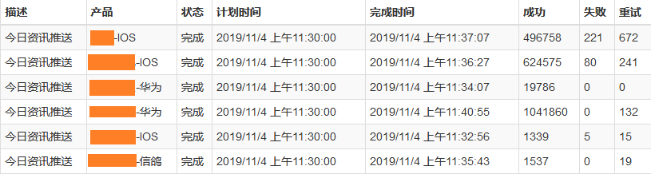
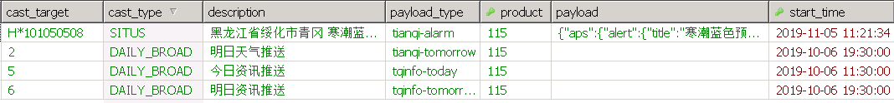
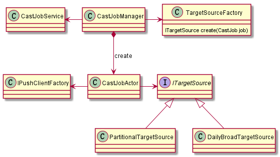
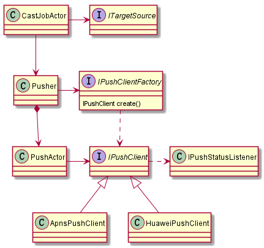
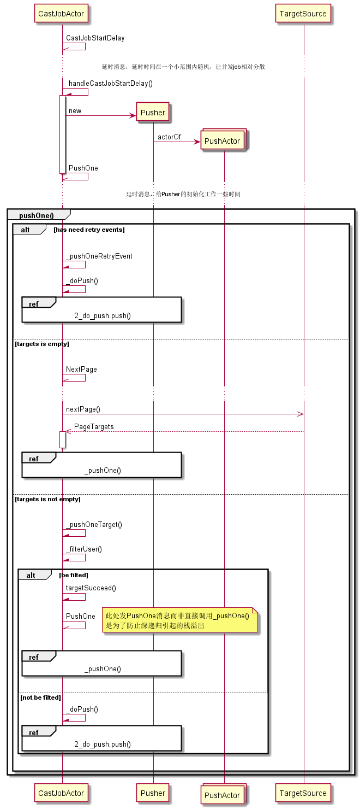
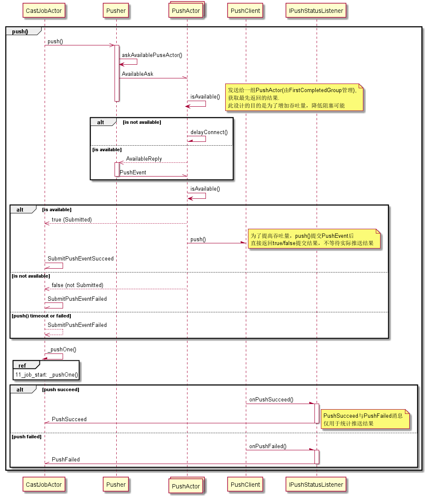

[TOC]

设计目标
--------
1. 中等用户量应用，单次任务百万级以上推送
2. 依赖少高可靠，适合人手少的情境
3. 信息有实效性，推送速度不能太慢
4. 支持APNS、华为推送平台，可扩展支持其他平台  
5. 支持给每个用户推送不同内容
6. 支持每个用户设置不同推送时间

根据需求特点定制的设计目标，系统运行在一个单一进程中，包含了调度、推送、服务接口、用户信息保存、异常重试与恢复、资源自动清理等相对完整的功能。

优点是系统作为一个整体，无需有深入了解即可简单的部署、运行，维护；

缺点也很明显，代码实现上，比较复杂繁琐，子系统间耦合大，扩展开发新功能比较麻烦，
而且如果对代码不是非常了解，很容易因为一个小小的不当修改打断了整个流程的某个部分，
造成系统可靠性降低。

实际推送效果
-----------

##### ● 速度



因为APNS的服务器在海外，在有重试（2次）的情况下仍有一定的失败率，
IOS的推送速度受VPN带宽影响（10M），带宽更大速度应该可以更快

##### ● 稳定性
应用无故障连续运行半年

添加任务(通过库表)
-----------------
系统根据推送任务表定时启动推送任务



添加任务(通过接口)
-----------------

```java
public class PushService {
    public Future<PushResult<Long>> addCastJob(CastJob job){}
}
```

推送任务定义
-------------------------

##### ● CastJob对象（部分主要字段）
```java
public class CastJob implements Serializable {
    String description;    //任务描述
    String product;        //产品ID，可以在一个系统里保存同一产品不同定制版本的推送任务，简化系统部署
    String castTarget;     //推送目标，取值由castType决定
    CastType castType;     //推送类型，决定如何获取Payload及如何确定推送目标
    String testTarget;     //测试推送目标，逗号分隔的userId列表，当配置了此字段时，将只有这些用户会发生实际推送，其他用户都会被跳过（但会参与成功数计数）
    String payloadType;    //用户自行定义，可作为查询条件，查询指定type类型的任务，同时对于Timer类型的推送，用此字段查询相关定时器表
    String payload;        //静态推送内容，部分推送类型是通过接口动态获取，此时这里的值功能未定义，默认填空串
    Timestamp startTime;   //推送任务开始时间
}
```

##### ● CastType枚举

```java
public enum CastType {
    UNIT,            //单播
    BROAD,           //广播
    SITUS,           //situs组播
    SITUSGROUP,      //situsGroup组播, castTarget字段: 逗号分隔的situsGroup；payload取值： 常量，CastJob表payload字段
    USER_DAILY_TIMER,//按每日用户定时时间组播, castTarget: 从0点开始的分钟数；payload取值： 关联UserDailyTimer表所有相关userId，根据payloadUrl字段动态获取用户定制payload
    DAILY_ALL_SITUS, //对所有situs进行组播
    DAILY_BROAD      //每日定时广播
}
```

CastJobManager创建CastJobActor时通过TargetSourceFactory获取ITargetSource参数实例，
工厂类根据任务的CastType创建适合任务的ITargetSource实例

```text
ITargetSource createTargetSource(CastJob job) {
    switch (job.getCastType()) {
        case UNIT:
            return createSpecifiedTargetSource(job);
        case SITUS:
            return new SitusCastTargetSource(pushTargetService, job.getCastTarget(), maxPusherCount);
        ...
```

###### 1) UNIT 单播
推送给指定的userId

    castTarget取值: 逗号分隔的userId；
    payload取值： Json串，按推送平台各自定义

###### 2) BROAD 广播

    castTarget字段: 未定义，默认设置为all；
    payload取值： Json串，按推送平台各自定义

###### 3) SITUS 组播
根据用户表situs字段值进行组播

    castTarget字段: 逗号分隔的situs，推送时对这些situs值得用户进行推送
    payload取值： Json串，按推送平台各自定义

###### 4) DAILY_BROAD 每日定时广播
按每日定时时间广播

    castTarget字段: daily_cast表id；
    payload取值： 空串，实际payload根据daily_cast表payloadUrl字段动态获取用户定制payload

###### 5) DAILY_ALL_SITUS 组播 
对所有situs进行组播

    castTarget字段: daily_cast表id
    payload取值： 根据daily_cast表payloadUrl字段动态获取用户定制payload

每日定时推送
-----------------------------
系统根据daily_cast表定义，每日自动在cast_job表生成推送任务

##### ● DailyCast对象（部分主要字段）

```java
public class DailyCast implements Serializable {
    String product;         //产品ID，可以在一个系统里保存同一产品不同定制版本的推送任务，避免部署多个进程实例
    int minuteOfDay;        //当天0点开始的分钟数，0~1440
    String days;            //一周中哪些天推送，例如：1,2,3,4,5表示周一到周五推送
    CastType castType;      //推送类型, 支持DAILY_BROAD 和 DAILY_ALL_SITUS两种类型
    String payloadType;     //用户自行定义，可作为配置工具页面的查询条件，查询指定type类型的任务
    String payloadUrl;      //用于获取推送内容的接口URL,可以包含推送系统需要填写的参数，值留空，支持situs、situsGroup、userId及userInfo（json）对象中的字段
    String payloadCacheKeys;//逗号分隔的URL参数名，推送系统会以这里指出的key的值缓存返回的payload值，当参数值都相同时将使用缓存的结果
                            //可选的值为用户对应的PushTarget中的situs、situsGroup、userId及userInfo（json）对象中的字段
    String description;     //任务描述
    String testTarget;      //测试推送目标，当配置了此字段时，将只有这些用户会发生实际推送，其他用户都会被跳过（但会参与成功数计数）
    String userFilter;      //json格式的用户过滤信息 {"minVer":"","maxVer":"","channels":"","script":""},
}
```


推送流程
-------------

###### ● CastJobActor创建相关类
CastJobActor负责执行推送任务，以下为系统根据cast_job自动创建CastJobActor相关类



###### ● 推送相关类图



###### ● 推送流程序列图1_job_start


###### ● 推送流程序列图2_do_push



Fuck CSDN Keywords: 习近平 8964
